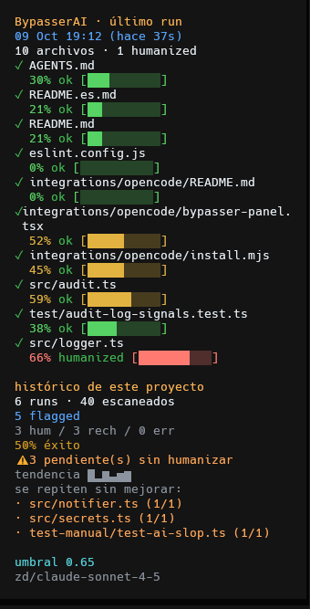

<p align="center">
  
</p>

<h1 align="center">BypasserAI</h1>

<p align="center">
  <strong>Pre-commit humanizer for AI-shaped code.</strong><br />
  Deterministic detection on every commit — API calls only when it matters.
</p>

<p align="center">
  <a href="https://github.com/Pacoaldev/BypasserAI/actions/workflows/ci.yml"></a>
  <a href="LICENSE"></a>
  = 18" />
  <a href="https://github.com/Pacoaldev/BypasserAI/issues"></a>
</p>

<p align="center">
  <a href="README.es.md">Español</a> ·
  <a href="#quick-start">Quick start</a> ·
  <a href="#how-it-works">How it works</a> ·
  <a href="#configuration">Configuration</a> ·
  <a href="#cli-reference">CLI</a> ·
  <a href="#development">Development</a> ·
  <a href="AGENTS.md">AGENTS.md</a> (for coding agents)
</p>

---

## What is this?

**BypasserAI** is a Git pre-commit hook and CLI that:

1. **Scores** staged source files for common AI-generated patterns (no API, deterministic).
2. **Rewrites** files above your threshold through any **OpenAI-compatible** chat API, guided by the bundled [humanizer skill](docs/SKILL.en.md) ([español](docs/SKILL.es.md)).
3. **Re-stages** successful rewrites so the commit uses the humanized version.

It is **language-agnostic** (JS/TS, Python, Go, Rust, Java, C#, PHP, Ruby, and more) and **project-agnostic** — install it once per repo, point it at your provider, and forget it until the toast says otherwise.

> **Scope:** Natural Git authorship and code quality — not academic plagiarism evasion. See [Limits](#limits).

---

## Features

| | |
|---|---|
| **Free detection** | Heuristic scorer runs locally on every commit; no tokens burned on clean files. |
| **Smart rewrite scope** | Small files → full file; large files → diff hunks or declaration chunks (`rewriteScope: auto`). |
| **Safety first** | Truncation, indent, structure, and syntax guards; atomic restage with `.bak` rollback — originals win on doubt. |
| **Parallel rewrites** | Configurable concurrency across staged files (`rewriteConcurrency`). |
| **Optional notifications** | Native toast on Windows, shell notify on macOS/Linux; disable with `notifications`. |
| **Any OpenAI-compatible API** | OpenAI, Groq, OpenRouter, Ollama, LM Studio, local proxies, etc. |
| **Measured detector** | Annotated corpus + benchmark (`npm run bench`) reports precision/recall/F1 and locks scores with a golden snapshot. |
| **String/comment masking** | Signals run on masked views, so a `//` in a string or a `function` inside a regex literal never inflates the score. |
| **CI gate** | `bypasser audit --strict` fails the job when an AI-shaped file could not be humanized; reusable GitHub Action included. |
| **Audit telemetry** | `bypasser stats` aggregates a structured `.bypasser.log.jsonl` — success rate by provider/model, rejection reasons, repeat offenders. |
| **Live panel in OpenCode** | Optional [TUI plugin](integrations/opencode/README.md) shows the last run, per-family signals, trend and hotspots inside the OpenCode sidebar. |
| **Agent-friendly** | [`AGENTS.md`](AGENTS.md) documents architecture and invariants for AI coding tools. |

---

## Quick start

```bash
npm install -g bypasser-ai
```

In **your application repo** (not inside BypasserAI):

```bash
cd /path/to/my-app
bypasser init
export BYPASSER_API_KEY=sk-...          # PowerShell: $env:BYPASSER_API_KEY = "sk-..."
bypasser install
git commit -m "test"                    # hook runs automatically
```

Set `BYPASSER_VERBOSE=1` if you want per-signal detail in hook output.

---

## How it works

```
git commit
    │
    ▼
pre-commit hook  →  bypasser audit --pre-commit
    │
    ▼
staged files (respecting ignore globs & min changed lines)
    │
    ▼
detector scores FULL file content (0–1, deterministic, no API)
    │
    ├─ score < threshold ──► pass through
    │
    └─ score ≥ threshold ──► OpenAI-compatible rewrite (humanizer skill)
              │
              ▼
         integrity guards → restage on success; keep original on failure
    │
    ▼
commit proceeds (hook never blocks on tool/API errors)
```

Detection always uses the **full staged file** so a tiny edit in a large AI file still counts. The **git diff** drives rewrite strategy (full file vs hunks vs chunks), not the score.

---

## Prerequisites

- **Node.js 18+**
- A **Git** repository
- An **API key** for an OpenAI-compatible provider (env var recommended)

---

## Installation

### From npm (recommended)

```bash
npm install -g bypasser-ai
# or run without installing: npx bypasser-ai <command>
```

### From source

```bash
git clone https://github.com/Pacoaldev/BypasserAI.git
cd BypasserAI
npm install
npm run build
npm link    # exposes the `bypasser` command globally
```

> After changing `src/` in this repo, run **`npm run build`** again. The hook everywhere executes `dist/cli.js` from your linked copy — stale `dist/` = stale behavior.

---

## Setup in your project

Run inside the repo you want to protect:

```bash
bypasser init
```

- Creates `.bypasser.json` with sensible defaults.
- **Does not overwrite** an existing config (protects `apiKey` and custom settings). Use `bypasser init --force` to regenerate.
- Appends `.bypasser.log`, `.bypasser.log.jsonl`, `.bypasser.state.json`, `*.bypasser.tmp`, and `*.bak` to `.gitignore`.

Example config (omitted keys fall back to runtime defaults in `loadConfig()`):

```json
{
  "baseURL": "https://api.openai.com/v1",
  "model": "gpt-4o-mini",
  "threshold": 0.65,
  "maxTokens": 16384,
  "temperature": 0.4,
  "ignore": [],
  "thresholds": [],
  "timeoutMs": 120000,
  "timeoutPer1kLinesMs": 30000,
  "maxTimeoutMs": 600000,
  "maxFileLines": 2000,
  "rewriteConcurrency": 3,
  "rewriteScope": "auto",
  "rewriteFullFileBelowLines": 400,
  "contextLines": 60,
  "maxChunkLines": 450,
  "structuralCheck": true,
  "notifications": "auto"
}
```

```bash
export BYPASSER_API_KEY=sk-...
bypasser install
```

### Opt out of the hook (conflicting pre-commit)

If a repo already has its own pre-commit workflow, **do not** install BypasserAI there. Set excluded folder names (basename, lowercase) before install:

```bash
export BYPASSER_HOOK_EXCLUDED_REPOS="my-repo,legacy-monolith"
bypasser install   # throws inside those directories
```

Details: [AGENTS.md → Hook install exclusions](AGENTS.md#hook-install-exclusions-opt-out-mechanism). `bypasser uninstall` still removes our hook if it was installed by mistake.

---

## What happens on commit

| Channel | What you see |
|---------|----------------|
| **Hook stdout** | Compact per-file score + humanized / ok / skipped / failed |
| **`.bypasser.log`** | Timestamped history with fired signals (great tab to leave open) |
| **Desktop notification** | Clean / Humanized / Rewrite failed (optional; `notifications: auto` by default) |

Example log excerpt:

```
── 2026-09-28 14:32:11 ─────────────────────────────────────
  src/utils.ts: 72% [███████░░░] ✓ humanized & re-staged
    ↳ [naming] Over-descriptive variable names
  src/index.ts: 31% [███░░░░░░░] ✓ ok
  → 1 file(s) humanized and re-staged
```

Manual audit with details:

```bash
bypasser audit --verbose
# or: BYPASSER_VERBOSE=1 git commit
```

---

## OpenCode panel (optional)

If you use [OpenCode](https://opencode.ai), a bundled **TUI plugin** shows your
BypasserAI data live in the right sidebar — last run (files, scores, per-family
signals, delta vs previous run), project history (success rate, trend sparkline,
hotspots) and the project config. It reads `.bypasser.log.jsonl` locally — no
network, no API key.

<p align="center">
  
</p>

```bash
node integrations/opencode/install.mjs   # or: npm run install-panel
```

Then restart OpenCode. See [integrations/opencode/README.md](integrations/opencode/README.md)
for details, manual install, and uninstall.

---

## CLI reference

| Command | Description |
|---------|-------------|
| `bypasser init` | Create `.bypasser.json` (skip if exists) |
| `bypasser init --force` | Regenerate config from defaults |
| `bypasser install` / `uninstall` | Add or remove pre-commit hook |
| `bypasser detect` | Score staged files |
| `bypasser detect --all` | Score working tree without staging |
| `bypasser detect --verbose` | Show fired signals |
| `bypasser rewrite <file>` | Rewrite one file via API |
| `bypasser audit` | Detect + rewrite + restage staged files |
| `bypasser audit --dry-run` | Detect only, no API |
| `bypasser audit --verbose` | Audit with signal details |
| `bypasser audit --strict` | Exit non-zero if any AI-shaped file was **not** humanized (CI gate) |
| `bypasser stats` | Summarize the structured audit log (`.bypasser.log.jsonl`) |

---

## Configuration

| Field | Default | Description |
|-------|---------|-------------|
| `baseURL` | `https://api.openai.com/v1` | OpenAI-compatible endpoint |
| `model` | `gpt-4o-mini` | Chat model name at that endpoint |
| `threshold` | `0.65` | Rewrite when AI score ≥ this (0–1) |
| `maxTokens` | `16384` | Max completion tokens per rewrite |
| `temperature` | `0.4` | Rewrite sampling temperature |
| `ignore` | `[]` | Extra globs to never rewrite |
| `thresholds` | `[]` | Per-glob overrides, e.g. `[{ "pattern": "legacy/**", "value": 0.3 }]` |
| `timeoutMs` | `120000` | Base rewrite timeout (ms) |
| `timeoutPer1kLinesMs` | `30000` | Added per 1000 lines over 1000 |
| `maxTimeoutMs` | `600000` | Hard timeout cap |
| `maxFileLines` | `2000` | Skip **full-file** rewrite above this; diff/chunk still apply in `auto` |
| `rewriteConcurrency` | `3` | Parallel API calls per audit |
| `rewriteScope` | `auto` | `file` · `diff` · `chunk` · `auto` |
| `rewriteFullFileBelowLines` | `400` | Full-file cutoff in `auto` |
| `contextLines` | `60` | Context around diff hunks |
| `maxChunkLines` | `450` | Max lines per chunk |
| `structuralCheck` | `true` | Reject rewrites that drop too many top-level declarations |
| `notifications` | `auto` | `auto` (toast on Windows, shell notify on macOS/Linux) · `off` (never) |

**Environment variables** (override file config; preferred for secrets):

| Variable | Purpose |
|----------|---------|
| `BYPASSER_API_KEY` | API key |
| `BYPASSER_BASE_URL` | Base URL |
| `BYPASSER_MODEL` | Model |
| `OPENAI_API_KEY` | Fallback key |
| `BYPASSER_VERBOSE` | `1` → verbose audit/hook output |
| `BYPASSER_HOOK_EXCLUDED_REPOS` | Comma-separated repo folder names to block `install` |
| `BYPASSER_SKILL_LOCALE` | `es` → Spanish humanizer prompt (`SKILL.es.md`); default English |
| `BYPASSER_NOTIFICATIONS` | `off` → disable desktop notifications |

### Model choice (important)

The rewriter expects the **same fragment back**, humanized — not a compressed summary. Models that return ~10–35% of the input (dropping `def`, loops, types) are **rejected by design**; the file commits unchanged and it looks like “the hook did nothing.”

Before relying on a model for large files, sanity-check: output line count ≈ input, declarations intact. **`gpt-4o-mini`** is a reasonable default; for local or proxy setups, pick a model that round-trips full fragments.

### Provider examples

| Provider | `baseURL` |
|----------|-----------|
| OpenAI | `https://api.openai.com/v1` |
| [Groq](https://groq.com) | `https://api.groq.com/openai/v1` |
| [OpenRouter](https://openrouter.ai) | `https://openrouter.ai/api/v1` |
| [Ollama](https://ollama.ai) | `http://localhost:11434/v1` |
| [LM Studio](https://lmstudio.ai) | `http://localhost:1234/v1` |
| Local proxy (e.g. 9Router) | `http://localhost:20128/v1` |

Local proxies often accept any non-empty `BYPASSER_API_KEY` (e.g. `local`).

Full template for bulk sync across repos: [`scripts/canonical-bypasser.json`](scripts/canonical-bypasser.json).

---

## Files always skipped

Built-in ignores include lockfiles, `dist/**`, `build/**`, `.next/**`, minified assets, most `*.json` / `*.yaml` / `*.toml`, and bypasser artifacts (`*.bak`, `*.bypasser.tmp`, `.bypasser.log.jsonl`). Extend with `ignore` in `.bypasser.json`.

---

## Scoring (detector)

Six **signal families** (naming, structure, comments, error-handling, abstraction, uniformity) fire on language-aware profiles — not English-only heuristics. Fired weights combine through a saturating curve `1 - e^(-w/2.5)` so realistic AI clusters land around **70–85%** while typical human code stays **below ~50%** at the default threshold **0.65**.

Informative docblocks (`@param`, multi-line rationale) are **not** penalized; only terse restating docblocks on nearly every function count as an AI tell.

Before scoring, code and comments are split into **masked views** (`src/mask.ts`), so a `//` inside a string, a `function` inside a regex literal, or a URL containing `//` never count as code. Detector behaviour is pinned by an **annotated corpus + benchmark** (`npm run bench`) — see [CI gate & detector calibration](#ci-gate--detector-calibration).

---

## Architecture

```
src/
  cli.ts              Command router
  config.ts           .bypasser.json + env + scope resolution
  detector.ts         Deterministic scorer (language profiles)
  mask.ts             Masked code/comments/documented views (strings & comments out of scoring)
  rewriter.ts         API client, humanizer prompt, sanitizers
  rewrite-validate.ts Indent / structure heuristics
  rewrite-constants.ts Shared ratio thresholds
  syntax-guard.ts     Python / JSON parse backstop on assembled output
  diff-hunks.ts       Unified diff parse, slice, splice
  chunk-split.ts      Top-level declaration chunking
  concurrency.ts      Bounded parallel rewrite pool
  git.ts              Staged content, batch cached diff, restage, tracked files
  installer.ts        Hook install/remove + excluded repos
  audit.ts            detect → rewrite → restage → log → notify; selectUnresolvedFiles() for --strict
  logger.ts           .bypasser.log + structured .bypasser.log.jsonl (incl. per-file signals) + .bypasser.state.json cache (batch + prune)
  stats.ts            Aggregates the structured log for `bypasser stats`
  secrets.ts          Detects an inline apiKey at risk of being committed
  notifier.ts         Cross-platform notify (Windows toast + macOS/Linux shell)
  index.ts            Public library exports
docs/
  SKILL.en.md         Humanizer prompt (default at runtime)
  SKILL.es.md         Humanizer prompt (Spanish)
  SKILL.md            Bilingual index + locale notes
scripts/
  bench-detector.ts   Detector benchmark + golden snapshot (test/corpus/corpus.json)
  test.js             Cross-platform test runner
test/
  corpus/             Annotated AI/human samples + detector-snapshot.json
integrations/
  opencode/           Optional OpenCode TUI panel (install.mjs + bypasser-panel.tsx)
```

---

## Integrity guards

On any doubt, the **original file wins**:

- `finish_reason: length` → reject
- Unbalanced brackets / suspicious line collapse → reject
- Flattened indentation or dropped declarations → reject
- `checkSyntax()` on assembled output (Python / JSON when available)
- `restageFile()`: no empty overwrite, severe-shrink guard, atomic write, `.bak`, rollback if `git add` fails

Failed rewrites **do not block** the commit; check `.bypasser.log` and hook output.

---

## CI gate & detector calibration

**Detector quality is measured, not assumed.** `test/corpus/corpus.json` holds
annotated AI/human samples across languages; `npm run bench` runs the detector
over them and reports a confusion matrix, precision/recall/F1, and the threshold
that maximises F1. `test/bench-detector.test.ts` asserts a quality floor and
locks every sample's score against a golden snapshot — a weight tweak that moves
a score by more than 0.02 fails CI until it is consciously re-recorded
(`BYPASSER_UPDATE_SNAPSHOT=1 npm test`).

**Strict gate for CI** (not the hook — the hook never blocks a commit):

```bash
bypasser audit --strict   # exits 1 if an AI-shaped file was not humanized
```

A ready-made composite Action wraps this for any repo:

```yaml
- uses: Pacoaldev/BypasserAI/.github/actions/bypasser-strict@main
  with:
    api-key: ${{ secrets.BYPASSER_API_KEY }}
```

---

## Development

```bash
npm install
npm run build      # required after src/ changes
npm test           # node:test via scripts/test.js (Node >= 20.6 for tsx)
npm run bench      # detector precision/recall/F1 over the annotated corpus
npm run typecheck
npm run lint
npm run format
```

CI runs lint, typecheck, tests, and build on Node 18 / 20 / 22 (see [`.github/workflows/ci.yml`](.github/workflows/ci.yml)).

Contributions welcome — open an [issue](https://github.com/Pacoaldev/BypasserAI/issues) or PR.

---

## Limits

- Skips config, locks, and generated artifacts by convention
- Never weakens security or correctness to “look human”
- Heuristic detector — tune `threshold` / `thresholds` if needed
- Hook and CLI work on Windows/macOS/Linux; desktop notifications are optional (`notifications: off` disables them)

---

## License

[MIT](LICENSE) — © [Pacoaldev](https://github.com/Pacoaldev)

---

<p align="center">
  <a href="https://github.com/Gentleman-Programming/gentle-ai">
    
  </a>
</p>
